# C入门-day1-熟悉研发环境

## 一   课程介绍

- **计算机常识【了解】**

- 软件开发概述【了解】

- **windows系统-**常用工具安装【了解】

- ubuntu环境安装与熟悉

  

## 二  计算机常识【了解/理解】

### 1 为什么需要了解

​		我们今明两天主要是搭建C++的开发环境，而搭建这个环境需要一台计算机，所以我们需要了解一些计算机的基本常识。

### 2 什么是计算机

​	计算机（computer）俗称电脑，是现代一种用于高速计算的电子计算机器，可以进行数值计算，又可以进行逻辑计算，还具有存储记忆功能。是能够按照程序运行，自动、高速处理海量数据的现代化智能电子设备。

​	应用领域从最初的军事科研应用扩展到社会的各个领域，已形成了规模巨大的计算机产业，带动了全球范围的技术进步，由此引发了深刻的社会变革，计算机已遍及一般学校、企事业单位，进入寻常百姓家，成为信息社会中必不可少的工具。

### 3 计算机组成

​	由**硬件系统**和**软件系统**所组成，没有安装任何软件的计算机称为裸机。

#### 3.1 计算机硬件

​	根据冯·诺依曼体系，可以把电脑系统的硬件单元一般可分为输入单元、输出单元、算术逻辑单元、控制单元及记忆单元，其中算术逻辑单元和控制单元合称中央处理单元（Center Processing Unit,CPU)。

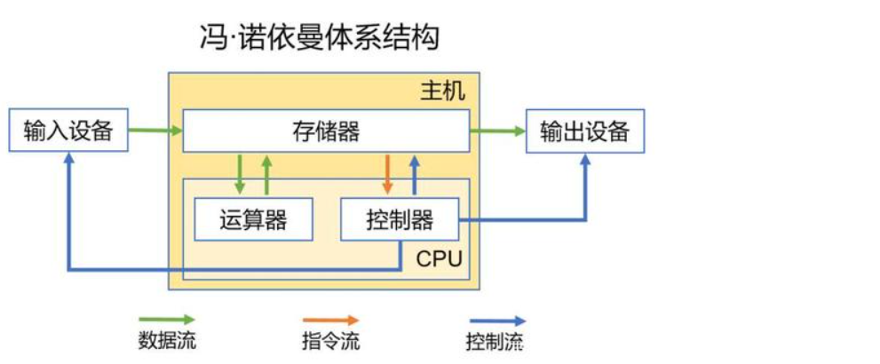

​	如：电源 主板 CPU 内存 硬盘 显卡 声卡 网卡 显示器 键盘 鼠标 音箱等。

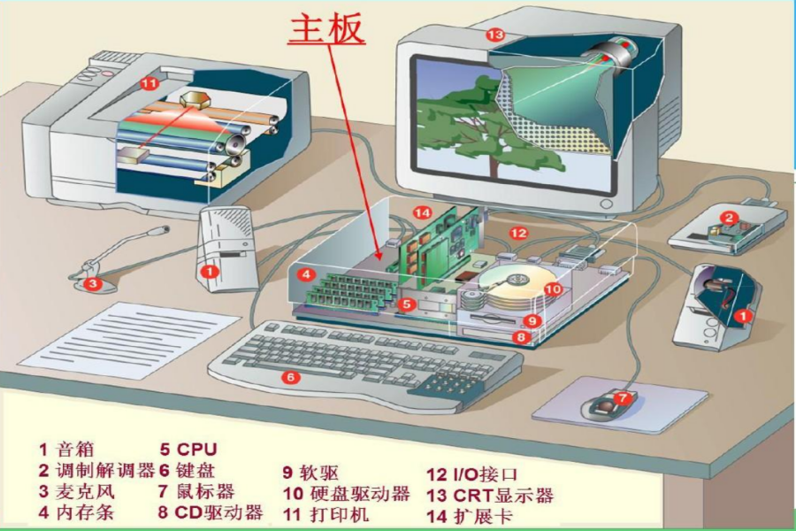

#### 3.2 计算机软件

​	所谓软件是指为方便使用计算机和提高使用效率而组织的程序以及用于开发、使用和维护的有关文档。软件系统可分为**系统软件**和**应用软件**两大类。

##### 3.2.1 系统软件

系统软件是指控制和协调计算机及外部设备,支持应用软件开发和运行的系统。

有代表性的系统软件有：

1）操作系统：Windows（办公）、MacOS、Linux（服务器操作系统）

 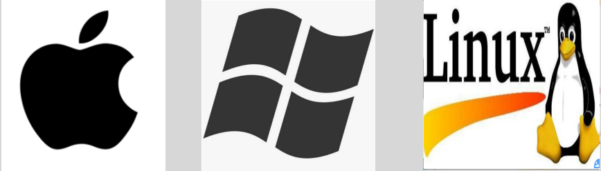

 

  2）数据库管理系统：关系型 Mysql、Oracle等

##### 3.2.2 应用软件

​	为解决各类实际问题而设计的程序系统称为应用软件。从其服务对象的角度，又可分为通用软件和专用软件两类。

### 4 小结

​	由于应用软件是运行在操作系统上的，所以，不同的应用，就需要针对不同操作系统进行开发，这就造成了软件兼容性问题。

计算机硬件和软件关系如图：

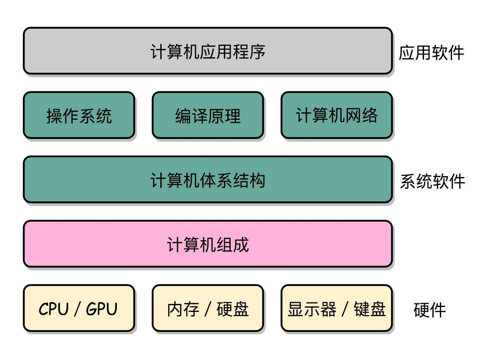

计算机系统软件和应用软件关系如图：

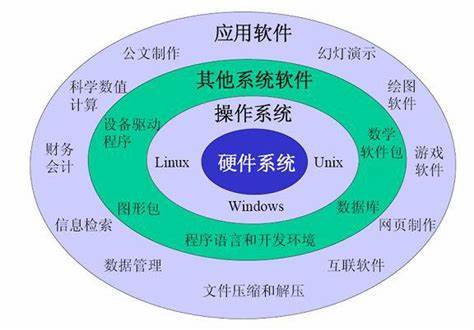

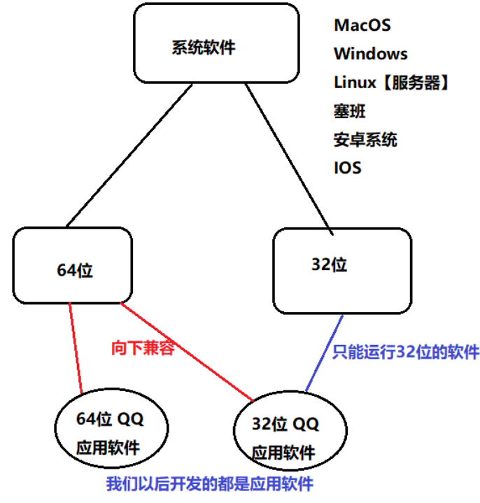

​      用户是来自于不同系统平台，好的软件要适配所有的用户，开发针对所有平台的应用。

> **电脑系统32位和64位有什么区别**
>
> - 支持的内存大小不同。32位的操作系统最多支持4G的内存，而64位的操作系统可以支持数十TB的内存。
> - 支持的处理器不同。64位的操作系统支持基于64位的处理器，而32位的系统不能完全支持64位的处理器。
> - 支持的软件不同。32位的系统只能运行32位的软件，而64位的系统可以向下兼容运行32位的软件。
> - 处理数据的能力不同。32位和64位表示CPU一次可以处理的数据量，64位的CPU一次可以处理64位数据，比32位的CPU更快。

## 三 软件开发概述

### 1 软件开发概念

> 软件开发是一项包括需求捕捉、需求分析、设计（原型设计（ps）、功能设计Xmind、技术架构设计）、开发实现和测试 部署 运营的系统工程。软件一般是用某种程序设计语言来实现的。

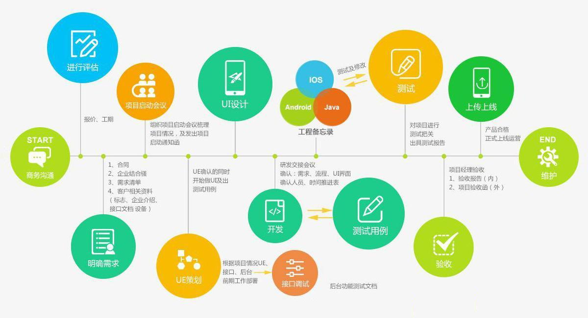

### 2 软件开发示例

举例：比如商场卖衣服，对这些衣服管理需要库存管理， 开发一个库存管理系统，库存管理系统软件需要哪些步骤呢？

​	1．需求分析:新增商品需要将商品信息录入系统之中，商品卖出，库存变化，活动时折扣价格，这些都是需求分析...

​	2．系统设计:使用什么样的技术才能让系统的效率高效快捷的运行，系统中的按钮位置设置，颜色图标，交互逻辑，用户体验是否完美等等，都需要进行设计

​	3．系统开发(**软件开发语言**):将设计思路使用代码去实现，编写代码去开发实现 设计 的功能

​	4．系统测试:测试系统功能是否按照设计思路去实现，功能是否完成，是否高效快捷。

​	5．系统部署:将项目部署到一个用户可以访问到的地方

### 3 软件开发语言

#### 3.1 计算机开发**语言**概述

在生活中的**人与人**需要交流，无非是采用一种彼此都能够识别的语言。那么，我们说该**语言**是他们传递信息的媒介。 

那么什么是计算机语言呢？计算机语言是指用于**人与计算机**之间通讯的一种特殊语言，是人与计算机 之间传递信息的媒介。 

为什么需要和计算机交流呢？计算机怎么能读懂我们给它发出的信息？ 

和计算机交流的目的，就是让计算机帮我们完成复杂工作，比如大量数据的运算。为了让计算机能读 懂我们发出的信息，此时就需要编写一套由**字符、数字所组成并按照某种语法格式的一串串计算机指令**，而这些指示和命令就是计算机语言。

#### 3.2 计算机语言分类

**机器语言：**直接用二进制指令表达，指令是用 0 和 1 组成的一串代码，它们有一定的位数，并分成若 干段，各段的编码表示不同的含义（如 0000 代表 加载（LOAD）,0001 代表 存储（STORE））。 

**汇编语言：**使用一些特殊的符号来代替机器语言的二进制码(又称符号语言)，计算机不能直接识别，需 要用一种软件将汇编语言翻译成机器语言，汇编语言依赖于硬件体系，开发难度大（如加法指令ADD/ADC、减法指令 SUB/SBB）。 

**高级语言：**使用一定格式的自然语言进行编写源代码，通过**编译器**将源代码翻译成计算机直接识别的 机器语言，之后再由计算机执行，不直接操作硬件，把繁琐的翻译操作交给编译器完成。

我们学习的 C，C++ 就属于高级语言范畴

我们以后做软件研发是要按照软件工程的流程（需求分析，系统设计，系统开发，系统测试，系统部署）来操作，并且我们在研发时要使用到类似C这样的计算机高级语言来开发。

> **解释：**
>
> **机器语言：**
>
> 计算机执行的二进制命令，都是0和1表示的
>
> **汇编语言：**
>
> 用助记符代替机器指令的操作码（如：ADD表示加法）
>
> **高级语言：**
>
> 更简单，符合人们的习惯，也更容易理解和修改。高级语言经过编译器编译之后可以得到目标程序。（如：C++、JAVA）
>
> **机器语言、汇编语言、高级语言的区别：**
>
> 依次接近人类自然语言的表达方式、代码效率依次变低、语言越来越高级
>
> **机器语言、汇编语言、高级语言的联系：**
>
> 高级语言要通过编译程序翻译成汇编代码，汇编语言要通过汇编得到机器语言，计算机才能执行。

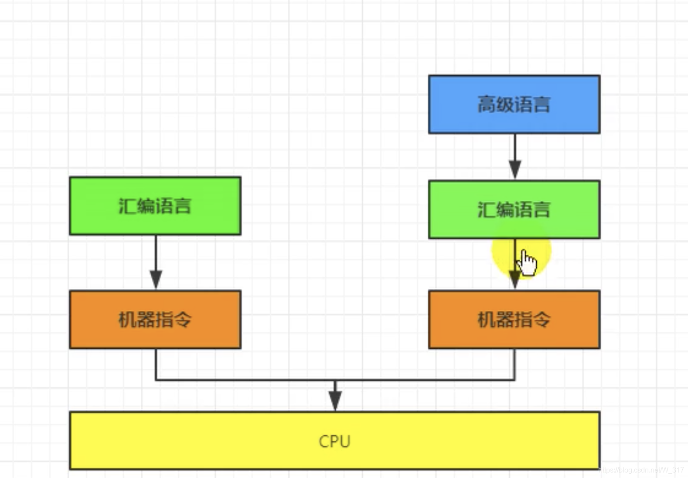

## 四 C研发环境搭建概述

​	由于大部分的C语言都是再Linux运行，所以为了减少环境的差异，大部分的都把linux作为开发环境，并且选择界面良好的**ubuntu**这个linux的来作为开发环境。

**第一种方案：**电脑的windows变更为ubuntu. 好处所有学习开发都在上面操作。

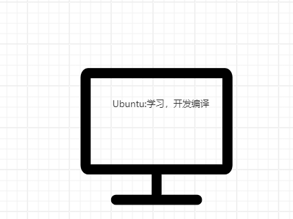

**第二种方案：**使用虚拟机技术在Windows上虚拟出一台Ubuntu出来。学习相关的在Windows，c开发编译相关的再Ubuntu。

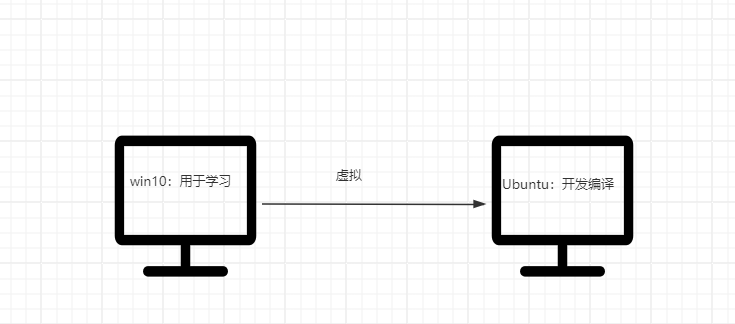

​	我选用第二种，也就是学习、办公、游戏在windows上面，开发c代码，编译执行c代码我们再unbutu上面，现在先熟悉windows，然后ubuntu就需要安装后熟悉了，接下来我们就先熟悉windows并安装常用的工具。

## 五 C研发环境搭建- windows学习环境

### 1 windows熟悉

#### 2.1.1 是什么

> Windows操作系统，是由美国[微软](https://baike.baidu.com/item/微软/124767)公司（Microsoft）研发的[操作系统](https://baike.baidu.com/item/操作系统/192)，问世于1985年。起初是[MS-DOS](https://baike.baidu.com/item/MS-DOS/1120792)模拟环境，后续由于微软对其进行不断更新升级，提升易用性，使Windows成为了应用最广泛的操作系统 [1] 。
>
> Windows采用了图形用户界面（[GUI](https://baike.baidu.com/item/GUI/479966)），比起从前的[MS-DOS](https://baike.baidu.com/item/MS-DOS/1120792)需要输入指令使用的方式更为人性化。随着计算机硬件和软件的不断升级，Windows也在不断升级，从架构的16位、[32位](https://baike.baidu.com/item/32位/5812218)再到[64位](https://baike.baidu.com/item/64位/2262282)，系统版本从最初的[Windows 1.0](https://baike.baidu.com/item/Windows 1.0/761751)到大家熟知的[Windows 95](https://baike.baidu.com/item/Windows 95/757614)、[Windows 98](https://baike.baidu.com/item/Windows 98/758579)、[Windows 2000](https://baike.baidu.com/item/Windows 2000/2769068)、[Windows XP](https://baike.baidu.com/item/Windows XP/191927)、[Windows Vista](https://baike.baidu.com/item/Windows Vista/214535)、[Windows 7](https://baike.baidu.com/item/Windows 7/1083761)、[Windows 8](https://baike.baidu.com/item/Windows 8/6851933)、[Windows 8.1](https://baike.baidu.com/item/Windows 8.1/768457)、[Windows 10](https://baike.baidu.com/item/Windows 10/6877791)、[Windows 11](https://baike.baidu.com/item/Windows 11/57321047)和[Windows Server](https://baike.baidu.com/item/Windows Server/271508)服务器企业级操作系统，微软一直在致力于Windows操作系统的开发和完善 [1] [17] 。

#### 2.1.2 windows盘符

C：通常作为系统盘  D E F根据自己的需要拆分（建议每个盘放不同类型的文件 

比如D盘安装软件  E盘存放个人文件 F盘存放学习相关文件）-**如果只有d盘建立文件夹来区分**

#### 2.1.3 **Windows常用快捷键**【掌握】-千万不要去记，慢慢掌握

​	**快捷键让本来通过鼠标进行的操作 都是用键盘完成操作。** **笔记本如果想按f2等功能键，要使用fn+f2**  

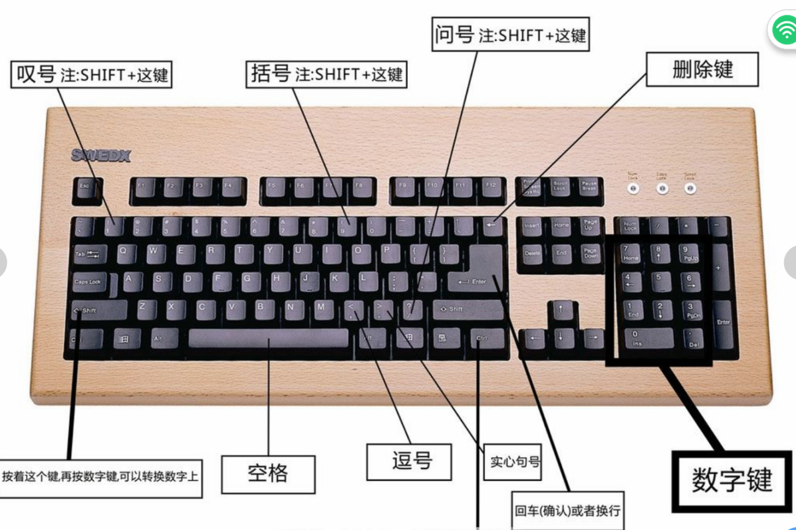

常用快捷键介绍：

**Ctrl+c:复制：（内容复制，文件复制）**

**Ctrl+v:粘贴：（内容粘贴：文件粘贴）**

**Ctrl+s:保存**

**Ctrl+x:剪切：（内容剪切：文件剪切）** 

**Ctrl+z:操作撤销：** 

Ctrl+y:反撤销：  

**Ctrl+F:查找搜索替换**

**Tab: 缩进，调代码格式，规范代码编写**	，补全命令						

**shift+Tab：反缩进**												

**Alt+Tab**: 切换工作界面

Shift: 

注：某些快捷键与其他软件的冲突（搜狗输入法 各种音乐软件）

win键快捷键：

**win+D：快速回到桌面**

**win+E：快速打开我的电脑**

win+i：快速打开windows设置

**win+L：快速锁屏**

#### 2.1.4 windows.令（很多命令）

DOS是Disk Operating System的缩写，即磁盘操作系统。

DOS命令，计算机术语，是指DOS操作系统的命令，是一种面向磁盘的操作命令，主要包括目录操作类命令、磁盘操作类命令、文件操作类命令和其它命令。

大家常用的操作系统有windows10, windows 7等，都是图形化的界面。在有这些系统之前的人们使用的操作系统是DOS系统。

主要分类：内部命令  外部命令  批命令

##### 2.1.4.1 进入DOS窗口**【掌握】**

**方式1**：win+R  打开运行窗口  输入cmd  按下enter运行（cmd：command命令）出现黑色dos命令窗口

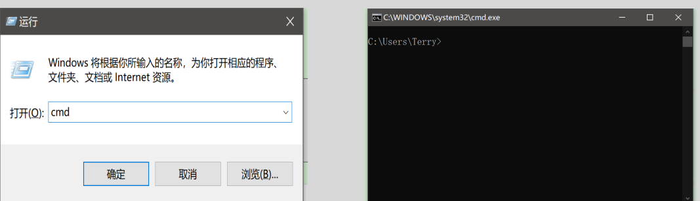

**方式2：搜索cmd 点击命令提示符**

**方式3：在文件夹地址栏，直接输入cmd**

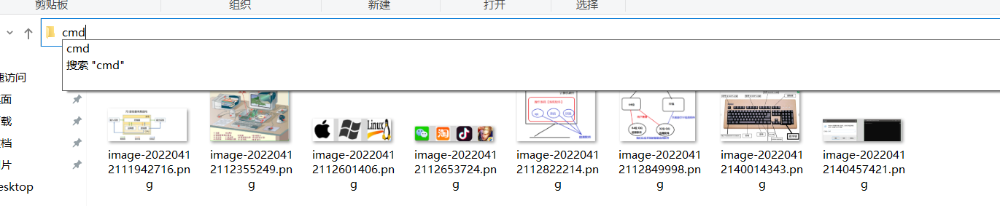

**好处：**进入cmd后，所在目录就位当前目录

##### 2.1.4.2  常见doc命令

> dir回车：列出当前目录下的文件以及文件夹（dir：directory 文件夹）
>
> cd 目录： 进入指定目录 （cd:change directory）
>
> ​      cd 路径
>
> ​      cd ..
>
> ipconfig:查看ip
>
> ping:查看是否能够连上某服务器
>
> exit：退出dos命令行
>
> cls:清屏
>
> 
>
> 打开控制面板: win+r  control
>
> 打开记事本：win+r notepad
>
> 打开画板：win+r mspaint

**注意：**windows如果要移动到其他磁盘，直接输入盘符编号 比如要移动到D盘，直接输入d:

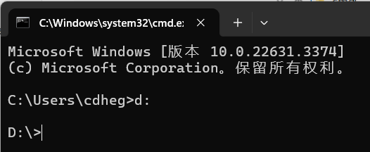

### 2 常用工具（软件）安装与使用

​	就是在软件研发操作系统上面安装一些软件，方便我们进行学习，和以后工作中使用。

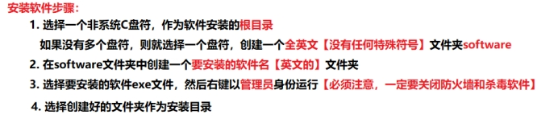

#### 2.2.1 输入法安装

​	**推荐“搜狗”输入法**

#### 2.2.2 视频播放器

​	推荐PotPlayer-可以加速

#### 2.2.3 浏览器安装

  专业的程序员只用**chrome**、Firefox

#### 2.2.4 办公软件office  docx

我们需要通过办公文件来写预习文档，总结文档等，所有我们需要学习一款办公软件，常见的办公软件有wps，office等，老师都是使用的wps，建议大家使用**wps**

#### 2.2.5 压缩与解压缩

   自己下载安装 winrar、7z

#### 2.2.6 Everthing本地搜索工具安装

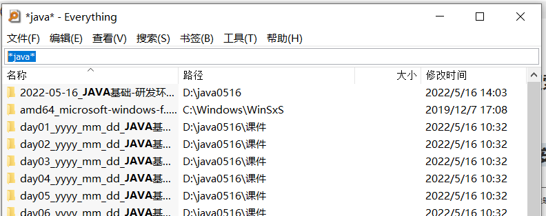

#### 2.2.7 markdown工具安装

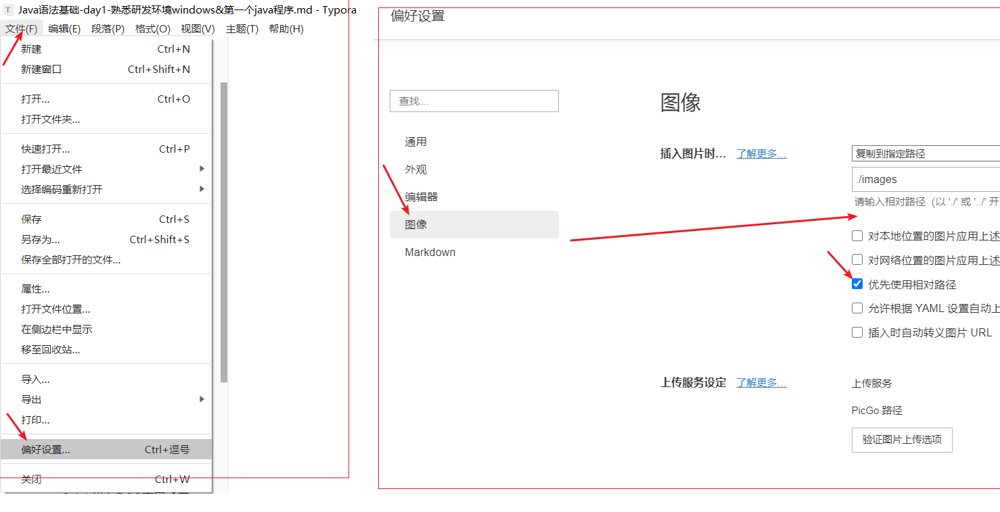

#### 2.2.8 截图软件

   直接使用qq，启动qq！ctrl+alt+A， windows + shift +s

专业截图+贴图软件：snipaste

1. 解压即可，发送Snipaste.exe到桌面快捷方式即可
2. 设置开机启动

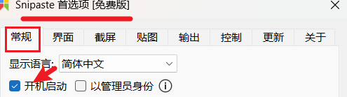

1. snipaste注意修改快捷键

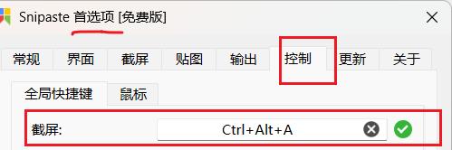

#### 2.2.9  搜索+翻译

我是我们要敲的代码知道中文但不知道怎么写，并且有可能不会读，所以可以自己在搜索引擎，找到在线翻译进行操作

http://bing.com(建议使用，没有太多广告)

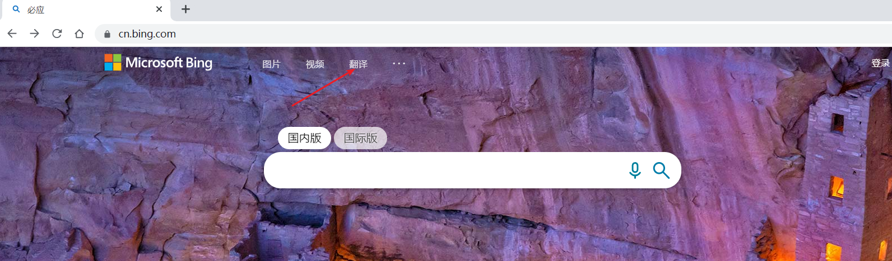

#### 2.2.11 xmind思维导图

​    我们一般用它来写总结

### 3 小结

## 六 课程总结

​	今天知识点较多，但是内容比较简单。只需要掌握老师要求掌握的知识点即可。多动手，多操作。

### 1 重点知识

​	ubuntu安装

### 2 难点知识

​	windows命令

## 七 课后练习

安装好windows常用的工具

打一下windows常用的dos命令

安装好Ubuntu并配置好共享目录何vmtools

## 8 面试题

## 十 补充

​    预习：大概看一下文档

​    听课： 搞个本记关键点

​    总结：你们也要做总结-xmind（30分钟）-先梳理大纲，写作业，再把核心代码贴到总结上面

​    做作业：每天不一样，但是一般都是当天代码，有时候会布置额外作业

 