# 职业发展&学习心态&学习要求

## 一   课程介绍

- 泛C++课程体系就业方向
- 职业发展【了解】
- 学习心态【了解】
- 学习要求【了解】

## 二  C++课程体系就业方向

### 2.1 软件领域

1. 软件主要分为**系统软件**和**应用软件**两大类。

   - **系统软件**是计算机的基本软件，负责管理计算机的硬件和应用程序，以及提供常见的系统功能。系统软件包括操作系统、设备驱动程序、系统工具等。操作系统是计算机的基石，负责管理计算机的硬件和软件资源，并提供一个统一的界面供用户操作计算机。设备驱动程序则是操作系统与硬件之间的接口，提供硬件设备的控制和操作能力。系统工具则是一些用于维护、优化和修复计算机系统的软件。
   - **应用软件**是专门设计用于执行特定任务或提供特定服务的软件。应用软件的范围非常广泛，包括办公软件、图像处理软件、游戏软件等。办公软件如Microsoft Office、WPS Office等，用于处理文档、电子表格和幻灯片等。图像处理软件如Adobe Photoshop、GIMP等，用于编辑、处理和创作图片。游戏软件则用于娱乐和休闲活动。
     - **应用软件**按照运行环境分类。这种分类方式将应用软件分为单机版和分布式软件。
       - **单机版软件**不需要连接网络就可以使用，例如计算器、压缩软件等。
       - **分布式软件**需要连接**网络**才能使用，如QQ、滴滴打车等。分布式软件又分为**C/S结构**（客户端/服务器）和**B/S结构**（浏览器/服务器）。

2. **c++/qt/java简单介绍**

   1. **c++**

      ​	**C++**通常适合那些需要“**硬件级**”操作的软件。二者之间的最大区别在于，**C++更接近机器语言**，因此其软件运行速度更快且能够**直接与计算机内存、磁盘、CPU或者其它设备进行协作**。另外，C++也能为游戏提供良好的运行性能。Java在Andriod开发和Web开发占据重要的位置。”C++通常适合那些需要“硬件级”操作的软件，Java更适合较高级别的应用。”

      > **百度百科：**	
      >
      > ​	C++（c plus plus）是一种计算机高级程序设计语言，由C语言扩展升级而产生 ，最早于1979年由本贾尼·斯特劳斯特卢普在AT&T贝尔工作室研发。
      >
      > ​	C++既可以进行C语言的过程化程序设计，又可以进行以抽象数据类型为特点的基于对象的程序设计，还可以进行以继承和多态为特点的面向对象的程序设计。C++擅长面向对象程序设计的同时，还可以进行基于过程的程序设计。 C++几乎可以创建任何类型的程序：游戏、设备驱动程序、HPC、云、桌面、嵌入式和移动应用等。 甚至用于其他编程语言的库和编译器也使用C++编写。 
      >
      > ​	C++拥有计算机运行的实用性特征，同时还致力于提高大规模程序的编程质量与程序设计语言的问题描述能力。
      >
      > ​	C++与C语言完全兼容，C语言的绝大部分内容可以直接用于C++的程序设计，用C语言编写的程序可以不加修改地用于C++。

      ​	一些软件（redis/nginx等）为了效率，往往选择贴近**汇编语言**的高级语言去实现，为了维护和便于阅读，往往选择面向对象的高级语言去实现。

      ​	**汇编语言**（Assembly Language）是任何一种用于电子计算机、微处理器、微控制器或其他可编程器件的低级语言，亦称为符号语言。在汇编语言中，用助记符代替机器指令的操作码，用地址符号或标号代替指令或操作数的地址。在不同的设备中，汇编语言对应着不同的机器语言指令集，通过汇编过程转换成机器指令。特定的汇编语言和特定的机器语言指令集是一一对应的，不同平台之间不可直接移植。

   2. **java**

      > ​	Java是一门面向对象的编程语言，不仅吸收了C++语言的各种优点，还摒弃了C++里难以理解的多继承、指针等概念，因此Java语言具有功能强大和简单易用两个特征。Java语言作为静态面向对象编程语言的代表，极好地实现了面向对象理论，允许程序员以优雅的思维方式进行复杂的编程。 
      >
      > ​	Java具有简单性、面向对象、分布式、健壮性、安全性、平台独立与可移植性、多线程、动态性等特点。Java可以编写桌面应用程序、Web应用程序、分布式系统和嵌入式系统应用程序等。
      
   3. QT

      > **百度百科：**	
      >
      > ​	Qt 是一个1991年由Qt Company开发的跨平台C++图形用户界面应用程序开发框架。它既可以开发GUI程序，也可用于开发非GUI程序，比如控制台工具和服务器。Qt是面向对象的框架，使用特殊的代码生成扩展（称为元对象编译器(Meta Object Compiler, moc)）以及一些宏，Qt很容易扩展，并且允许真正的组件编程。
   
   ​	C++Qt是一个强大的跨平台框架，它提供了丰富的工具和类库，使得开发者可以轻松地开发图形用户界面(GUI)应用程序和网络应用程序。C++Qt已经存在多年，一直在不断地更新和发展，目前也有很多活跃的社区在支持和维护它。

   ​	基于C++的Qt拥有一切C++的特性，在Qt中也可以使用C++开发跨平台的应用程序，Qt C++在不同的操作系统上提供了一套平台抽象，允许开发者专注于手上的任务，不需要你去了解如何在不同的操作系统上打开一个文件。这意味着你可以在Windows，OS X和Linux重复编译相同的代码，不用去过份考虑不同平台上的适配问题，Qt会自动帮你解决这些。最终保持本地构建的应用程序与目标平台的窗口风格上看起来一致。随着移动平台的桌面更新，Qt也提供相同的代码在不同的移动平台上编译，例如IOS，Android，Jolla，BlackBerry，Ubuntu Phone，Arm等。这样不仅仅是代码可以重用，开发者的技能也可以重用。由于Qt的这些特性，让的了解Qt的团队比只专注于单平台特定技能的团队可以接触更多的平台，也因为Qt的灵活性，团队可以使用相同的技术创建不同平台的组件。

   ​	关于编码的问题。对于所有平台，Qt提供了一套基本类，例如支持完整unicode编码的字符串，链表容器，向量容器，缓冲容器。它也提供了目标平台的通用主循环抽象和跨平台的线程支持，网络支持。Qt的主旨是为Qt的开发者提供所有必须的功能。对于特定领域的任务，例如本地库接口，Qt也提供了一些帮助类来使得这些操作更加简单。

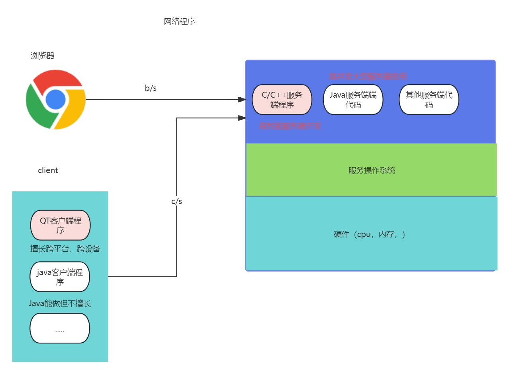

​	网络程序： 

1. 高性能服务器开发： Nginx是c语言开发的，Redis c语言 。
2. QT客户端程序开发：微信，QQ等后续都会改写为C++QT

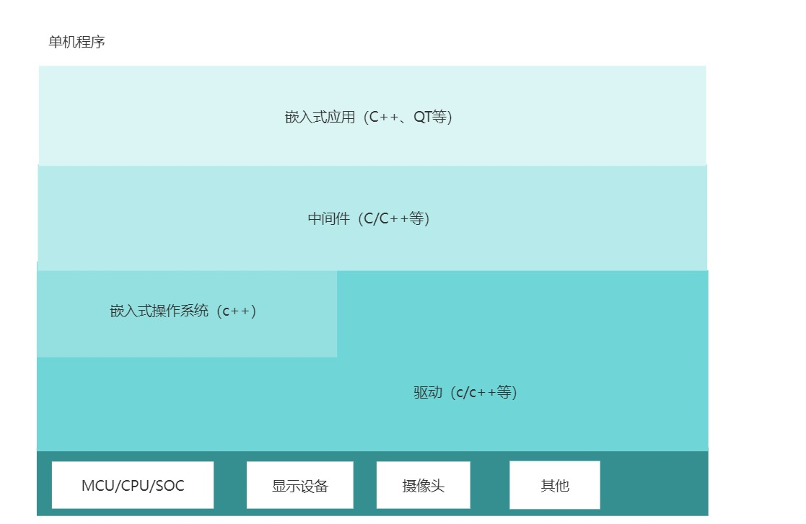

   单机程序：

1. 驱动开发
2. 操作系统改写或开发
3. 中间件开发
4. 嵌入式应用开发

### 2.2 岗位

C++服务器开发工程师
QT开发工程师
中间件开发工程师
驱动开发工程师
Linux kernel 工程师
嵌入式 Linux 应用工程师
Android 驱动开发工程师
等等几十个职位

### 2.3 行业

#### 2.3.1 金融/游戏行业

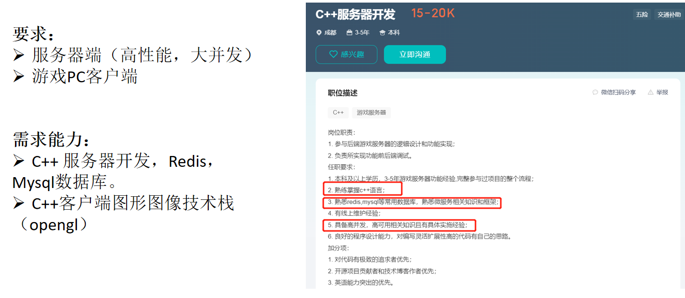

#### 2.3.2  工业行业

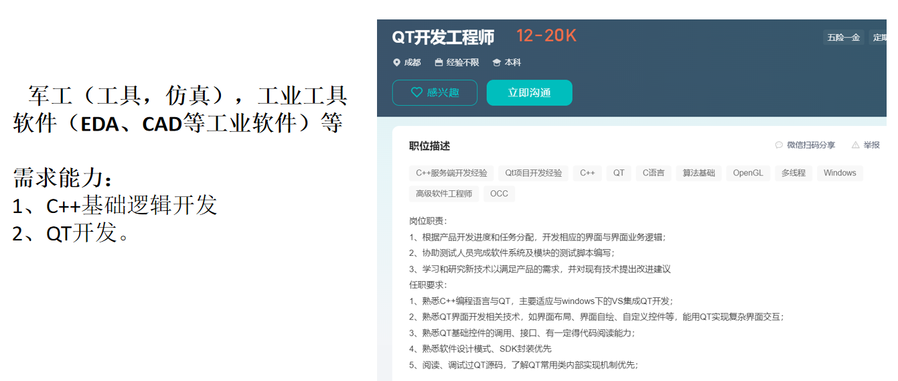

#### 2.3.3 医疗

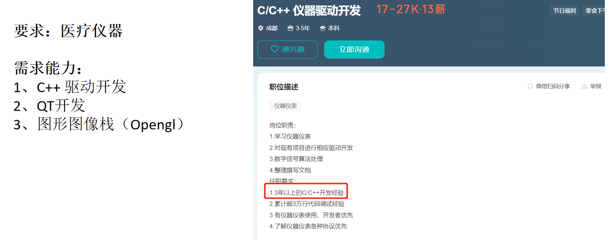

#### 2.3.4 汽车

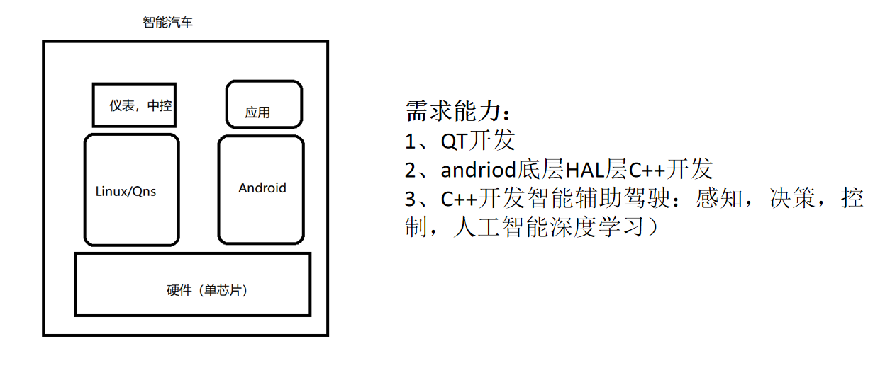

#### 2.3.5 物联网+硬件盒子设备

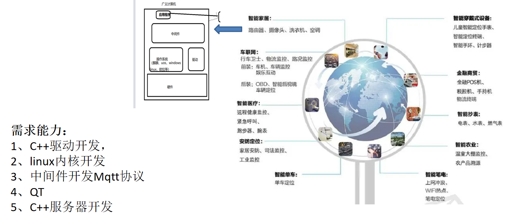

#### 2.3.6 通用应用软件开发（跨系统应用软件开发）

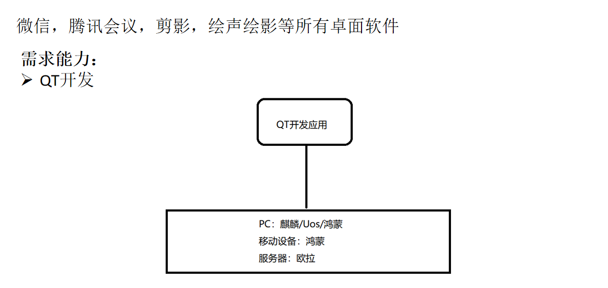

#### 2.3.7 操作系统领域

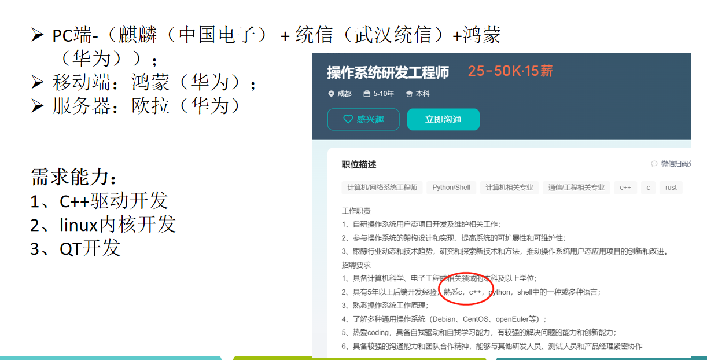

#### 2.3.8 音视频领域

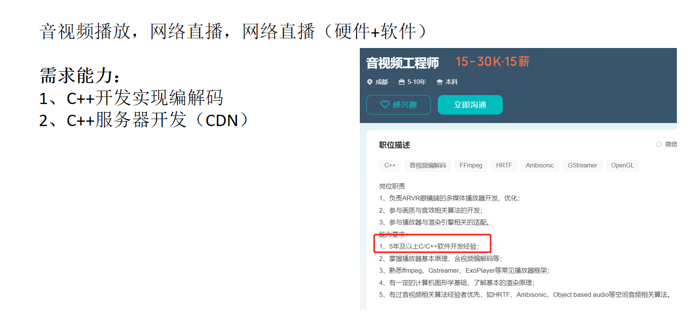

## 三 职业发展【了解】

### 1  趋势

​		当前西方国家对中国科技打压，对芯片、操作系统、工具软件，仪器仪表等都限制销售。同时特别俄乌、以巴冲突等大家加强军备军工储备。物联网发展。在此大背景下，为了国家安全，国家提出了国产化替代，信创战略，而在这些都会都需要大量C++人才。

 		C++开发对于零基础进IT行业的学员来说是一个发展前景非常好的技术方向，薪资待遇也非常可观，但这背后要有能够支撑自己拿高薪的技术水平，如今市面上对于C++开发岗位非常多，合起来岗位数量也非常大。

### 2 为什么需要了解职业发展

​		既然我们在这儿学习，要知道我们经过大概半年的学习我们能够达到什么水平，以及三五年以后能够达到什么水平，这就需要了解职业规划。

### 3 职业发展

> 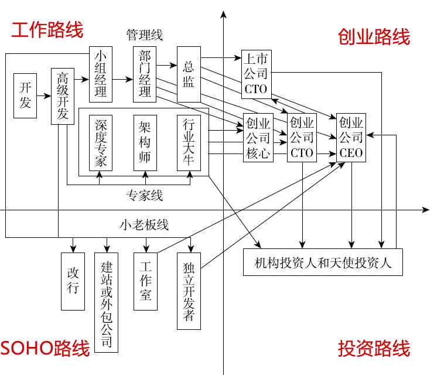
>

## 四  课程体系

1. c/c++基础、数据结构、c++、网络、qt、嵌入式，每个部分都有项目实战（3-5个企业级项目，至少五个练习项目）。
2. 中间贯穿代码管理git，敏捷开发等
3. 总体时间4.5个月

## 五 学习心态【了解/重要】

**整体而言：要有一种认识：C++单易学，功能强大，学习了C++就是学习了一切！！！**

- ​	 要耐得住寂寞，踏实安心学习，戒骄戒躁。 

- ​	不要觉得难，有问题及时和同学、老师多沟通多交流，其实只要掌握方法后，并**养成习惯**，就会越来越简单。(大部分的时间都是11点睡觉，有些时候10.30也会睡觉(频率很低)，如果我没有回)  

**有一定基础的：**

​	不要觉得前面太简单，课程是循序渐进的。可以对自己要求严格一点，深入理解或者往后学习，也可以去刷题库，例如：LeetCode、牛客网

**基础薄弱的：**(完全没有接触过编程，并且中途有3年以上没有学习过)

​	前期刚开始可能有点吃力，但是你只要按照我们学习方法（给大家介绍），并且严格要求，坚持一段时间【最多1到2周】，最终一定是可以的，记住万事开头难，坚持和努力是通向成功的必备要素。

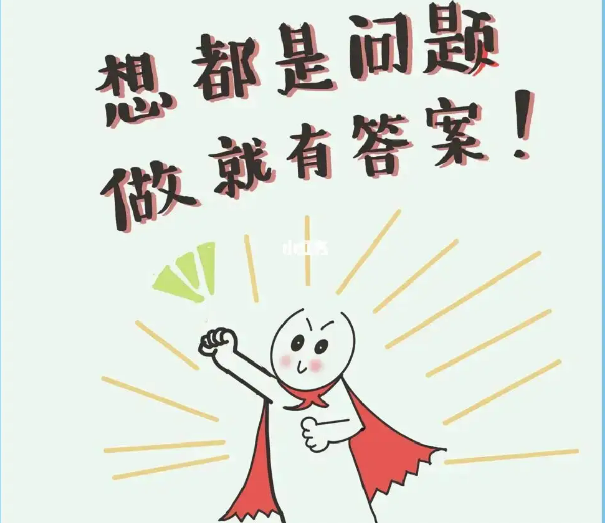

学习到**第5-7天**左右，很多同学有种感觉，**上课听得懂，下课也看得懂代码，只是独立敲不出来**（正常的，并且你已经学得很好了）

学习**面向对象**的时候，你有种感觉，**都听得懂，也看得懂，不知道运用场景**（你不要管，第二阶段你自然而然就明白了）

**心态一定要健康强大，多听老师的意见，你就成功80%了**

## 六 学习要求【了解/重要】  

预习（非必要），

听课（记笔记），

总结（大纲性）：敲代码-总结（代码贴上去，心得写到上面）和理论总结

### 1 整体要求

1. 不准迟到缺勤，上课前10分钟必须在教室看到本尊。
2. 如有非常特殊事情需要处理，请提前和班主任、授课老师沟通协调。
3. 上课期间不准玩手机(特别是打游戏的同学，下课期间、上课期间不能看游戏相关的视频，更加不能在教室里面玩游戏)，打瞌睡！【1. 站着听 2. 雀巢醇品咖啡 3.红牛 4. 风油精 5.醒目湿巾】----晚上回家之后，12点半就准时睡觉
4. 每天的任务必须完成！
5.  请每人准备一个笔记本（纸质的）和一支笔：(记录上课没听懂的知识点，下课就马上问老师)		

### 2 每日总结-课堂记忆

1. 前期不懂的，直接问老师    
2. 上课记录听不懂的知识点，下课直接问老师，如果不懂的知识点很多，一定要询问老师意见之后，才考虑是否看视频
3. 千万不要老师讲一个知识点就记录一个知识点
4. 下课不准给我看视频(教了这么多学生，留级同学90%特点，都是看视频)，如果真的要看视频，一定要在老师的指导下才准看

>  **作用：**	
>
> 及时记录自己的一些学习想法；
>
> 上课没有太懂的知识点；
>
> 以及画图分析代码结构；

### 3  请每人准备一个Word文件(或者在线笔记)

> 在线笔记：有道云笔记、语雀、印象笔记等 
>
> **作用：**
>
> 记录整理编码过程中所遇到的所有错误，异常；
>
> 记录自己觉得比较经典的代码和示例；
>
> 积累常见的一些英文单词；
>
> 请务必每天都坚持！！！

## 七 总结

- 整体来说C++的发展非常OK
- 学习C++要在”**战略上藐视敌人、战术上重视敌人**“